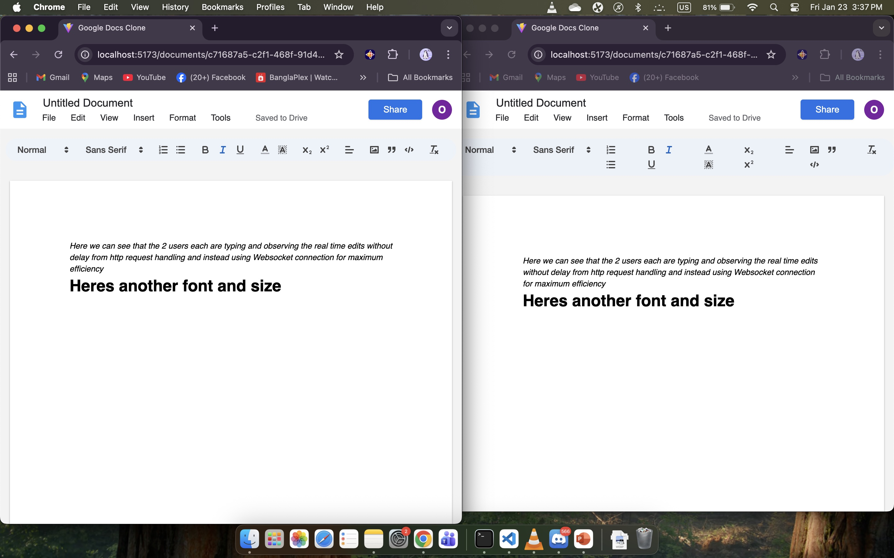

# Real-Time Collaborative Text Editor

A functional clone of Google Docs designed to handle real-time concurrency. I built this to understand how WebSockets handle state synchronization between multiple users without lag or conflict.



[**Watch the full demo video**](assets/demo-video.mov)

## Core Features
*   **Live Collaboration:** Uses Socket.io to broadcast "deltas" (changes) rather than full files, ensuring speed.
*   **Rich Text Editor:** Integrated Quill.js for formatting (bold, headers, lists).
*   **Auto-Persistence:** All changes are saved to MongoDB automatically in the background.
*   **Room Management:** Dynamic document creation using UUIDs; multiple docs can be edited simultaneously.

## Tech Stack
*   **Frontend:** React, Vite, Quill
*   **Backend:** Node.js, Express, Socket.io
*   **Database:** MongoDB (Mongoose)

## How to Run locally
1.  **Database:** Start your local MongoDB instance.
    ```bash
    brew services start mongodb-community
    ```
2.  **Server:** Navigate to `/server` and run `npm run dev`.
3.  **Client:** Navigate to `/client` and run `npm run dev`.
4.  **Test:** Open `http://localhost:5173` in two different browser tabs. Type in one and watch the other update instantly.